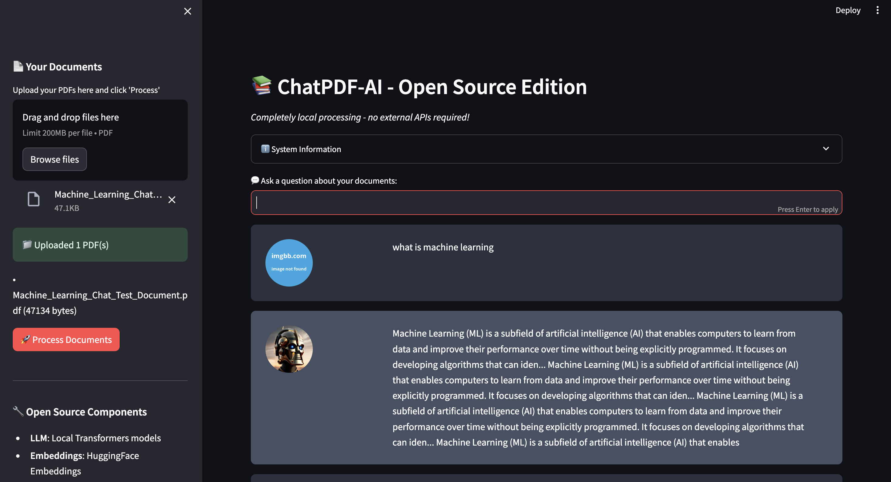

# 🚀 ChatPDF-AI Open Source Edition


**Completely local PDF chat application with no external API dependencies!**

## 🌟 Features

- **100% Open Source**: No proprietary APIs or services
- **Privacy First**: All processing happens locally on your machine
- **Offline Capable**: Works without internet connection (after initial setup)
- **Free Forever**: No API costs or usage limits
- **GPU Accelerated**: Supports CUDA for faster processing
- **Multiple PDFs**: Upload and chat with multiple documents simultaneously

## 🏗️ Architecture

### Local Components
- **LLM**: Local transformer models (DistilGPT2, DialoGPT)
- **Embeddings**: HuggingFace sentence-transformers
- **Vector Database**: FAISS (local storage)
- **UI**: Streamlit web interface
- **PDF Processing**: PyPDF2

### Models Used
1. **Primary**: `microsoft/DialoGPT-medium` (conversational AI)
2. **Fallback**: `microsoft/DialoGPT-small` (smaller conversational model)
3. **Emergency**: `distilgpt2` (lightweight text generation)
4. **Embeddings**: `sentence-transformers/all-MiniLM-L6-v2`

## 🚀 Quick Start

### Option 1: Automated Setup
```bash
# Clone and setup
git clone https://github.com/ayushkumar912/ChatPDF-AI.git
cd ChatPDF-AI

# Run setup script
./setup_opensource.sh

# Start the application
./run_opensource.sh
```

### Option 2: Manual Setup
```bash
# Create virtual environment
python3 -m venv venv
source venv/bin/activate

# Install dependencies
pip install -r requirements_opensource.txt

# Run the application
streamlit run app_opensource.py
```

## 💻 System Requirements

### Minimum Requirements
- **Python**: 3.8 or higher
- **RAM**: 4GB (8GB recommended)
- **Storage**: 2GB free space (for models)
- **OS**: macOS, Linux, or Windows

### Recommended for Better Performance
- **RAM**: 16GB or more
- **GPU**: NVIDIA GPU with CUDA support
- **Storage**: SSD for faster model loading

## 📦 Dependencies

### Core Libraries
- `langchain==0.0.354` - LLM framework
- `langchain-community==0.0.10` - Community LLM integrations
- `streamlit==1.28.1` - Web UI framework
- `transformers==4.35.2` - Hugging Face transformers
- `sentence-transformers==2.2.2` - Text embeddings
- `torch>=2.0.0` - PyTorch for ML
- `faiss-cpu==1.7.4` - Vector similarity search
- `PyPDF2==3.0.1` - PDF text extraction

### Optional Enhancements
- `accelerate>=0.20.0` - Faster model loading
- CUDA toolkit (for GPU acceleration)

## 🎯 Usage Guide

### 1. Starting the Application
```bash
./run_opensource.sh
```
This will:
- Activate the virtual environment
- Check dependencies
- Display system information
- Start the Streamlit server
- Open your browser to the application

### 2. Using the Interface

#### Upload Documents
1. Use the sidebar file uploader
2. Select one or more PDF files
3. Click "🚀 Process Documents"
4. Wait for processing to complete

#### Chat with Documents
1. Enter your question in the text input
2. Press Enter or click outside the input
3. Wait for the local model to generate a response
4. View the answer and source document references

### 3. Model Selection
The application automatically tries models in order of preference:
1. `microsoft/DialoGPT-medium` (best quality)
2. `microsoft/DialoGPT-small` (good balance)
3. `distilgpt2` (fastest, basic responses)

## ⚠️ Important Notes

### First Run
- **Model Download**: First run downloads ~500MB of models
- **Processing Time**: Initial model loading takes 2-5 minutes
- **Internet Required**: Only for the first run to download models

### Performance Tips
1. **GPU Usage**: Enable CUDA for 3-5x faster processing
2. **Memory**: Close other applications to free up RAM
3. **Document Size**: Smaller PDFs process faster
4. **Question Length**: Keep questions concise for better responses

### Limitations
1. **Response Quality**: Local models provide simpler responses than cloud APIs
2. **Processing Speed**: Slower than cloud-based solutions
3. **Context Length**: Limited context window for long documents
4. **Language Support**: Primarily optimized for English

## 🔧 Troubleshooting

### Common Issues

#### "Failed to load model"
- **Cause**: Insufficient memory or disk space
- **Solution**: Try closing other applications or use a smaller model

#### "No text extracted from PDF"
- **Cause**: PDF contains only images or is password protected
- **Solution**: Use PDFs with selectable text

#### "CUDA out of memory"
- **Cause**: GPU doesn't have enough memory
- **Solution**: The app will automatically fall back to CPU

#### Slow response times
- **Cause**: Running on CPU or large documents
- **Solutions**:
  - Enable GPU if available
  - Use smaller PDF documents
  - Ask more specific questions

### Getting Help
1. Check system requirements
2. Verify all dependencies are installed
3. Try restarting the application
4. Check available disk space and memory

## 🆚 Comparison with Cloud Version

| Feature | Open Source | Cloud APIs |
|---------|-------------|------------|
| **Cost** | Free | Paid per usage |
| **Privacy** | 100% local | Data sent to third parties |
| **Internet** | Not required* | Always required |
| **Setup** | One-time download | Instant |
| **Response Quality** | Good | Excellent |
| **Speed** | Moderate | Fast |
| **Customization** | Full control | Limited |

*After initial model download

## 🛡️ Privacy & Security

### Data Privacy
- **No External Calls**: All processing happens locally
- **No Data Sharing**: Your documents never leave your machine
- **No Logging**: No usage data sent to external services
- **Complete Control**: You own and control all data

### Security Features
- Local processing eliminates data transmission risks
- No API keys or tokens required
- No network dependencies after setup
- Full offline capability

## 🚀 Performance Optimization

### Hardware Recommendations
```python
# Check your system capabilities
import torch
print(f"CUDA Available: {torch.cuda.is_available()}")
print(f"GPU Count: {torch.cuda.device_count()}")
print(f"GPU Name: {torch.cuda.get_device_name(0) if torch.cuda.is_available() else 'N/A'}")
```

### Memory Optimization
- Close unnecessary applications
- Use smaller PDF files when possible
- Process documents one at a time for large files

### Model Selection Tips
- Start with `distilgpt2` for testing
- Upgrade to `DialoGPT-small` for better conversations
- Use `DialoGPT-medium` only with sufficient resources

## 📈 Future Enhancements

### Planned Features
- [ ] Support for more document formats (DOCX, TXT, etc.)
- [ ] Larger local models (Llama, Mistral)
- [ ] Document summarization
- [ ] Multiple language support
- [ ] Conversation export
- [ ] Advanced search capabilities

### Model Upgrades
- Integration with newer open-source models
- Support for quantized models (smaller size)
- Custom model training capabilities

## 📝 License

This project uses various open-source components:
- Core application: [Your License]
- Models: Various (check individual model licenses)
- Dependencies: See individual package licenses

## 🤝 Contributing

We welcome contributions! Areas where help is needed:
- Model integration and optimization
- UI/UX improvements
- Performance enhancements
- Documentation updates
- Testing and bug reports

---

**🎉 Enjoy your completely open-source, privacy-focused PDF chat experience!**
